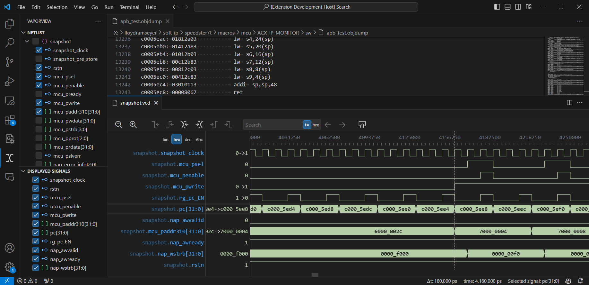
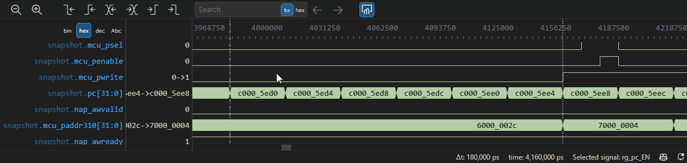
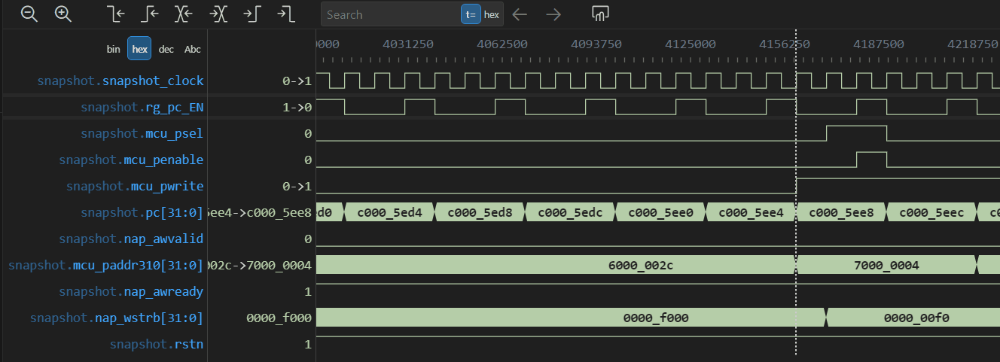

# VaporView

VaporView is a VCD waveform viewer extension for Visual Studio Code designed for FPGA/RTL developers.

## Controls

### Keyboard Shortcuts

- **Ctrl + Scroll Wheel** - Zoom in and out on waveforms
- **Shift + Scroll Wheel** - Scroll up and down on waveforms
- **Up/Down Arrow** - Select signal above/below selected signal
- **Alt + Up/Down Arrow** - Rearrange selected signal
- **Ctrl + Left/Right Arrow** - Move marker to previous/next value transition of selected signal
- **Alt + Click or Middle Click** - Set Alt-Marker

### Adding and Removing Signals

Signals may be added or removed through VaporView view container. Click on the VaporView Activity Bar icon, and it will show the netlist for the opened waveform file as well as the signals displayed in the tab.

To Add a signal, simply check the box next to the netlist signal ID in the "Netlist" view. It will also show in the "Displayed Signals" view.

To remove a signal, that signal can be un-checked from either the "Netlist" view or the "Displayed Signals" view. Alternatively, you can right click on a signal in the viewer and select "remove signal" from the menu.

To add or remove multiple signals, select the signals you would like to add or remove, right click and select "Add/Remove selected signals" from the menu.

### Scrolling

The scroll wheel (or touchpad scroll) is used to pan in time or scroll up or down. By default, mouse mode scrolling is enabled. To toggle between scrolling modes, click the **"Enable Touchpad Scrolling"** Button on the top right

#### Mouse Scrolling

Scrolling behaves as you would expect except for when scrolling the actual waveforms (where it scrolls sideways by default.) To scroll up or down, either hold Shift and scroll, or move your marker over to the signal name labels on the left and scroll normally.

#### Touchpad Scrolling

### Zooming

To Zoom in or out, hold **Ctrl**, and **Scroll** to zoom. Or use the Zoom in/out buttons on the top right.

### Rearranging signals

To rearrange signals, hover over the signal name, and you will see a rearrange grabber indicator on the left. Click and drag to rearrange.

Alternatively, you can select a signal, hold **Alt**, and press on the **Up** or **Down** Arrows to reorder (similar to how you reorder lines in the text editor)

### Marker Handling

There are two markers in vaporview: a normal marker, and an alt-marker. To place the marker, simply click where you want it to be placed. Keep in mind that it will snap to edge if applicable. To place the alt-marker, either **Middle Click**, or **Alt + Click** where you would like to place it. The alt-marker will also snap to an edge if applicable.

It should also be noted that signals can be selected by clicking on them, You can also use the **Up/Down** Arrow keys to move the selection.

#### Next/Previous Edge

To move the marker to the nearest edge _**of the selected signal**_, you can either click the control bar buttons, or use **Ctrl + Left/Right** Arrow (similar to how in the text editor, you can move the marker to a word boundary) Alternatively, Vaporview also supports the Verdi bindings of using **"N"** and **"Shift + N"** to go to the next and previous edge respectively.

To move to the next positive edge or negative edge, you will have to use the control bar buttons. This only applies to single bit waveforms.

#### Finding values and transitions in a particular waveform

Finding a particular transition or a value in a waveform is done in relation to the selected signal and the marker (similar to how Visual Studio Code handles search in relation to the marker)

### Saving and loading opened signals

Vaporview allows you to save and load your signal list. To do this, hit **Ctrl + Shift + P** and Type **">Save Vaproview Settings"** or **">Load Vaproview Settings"** and press **Enter** to slect the command. A dialog box will pop up prompting which file you would like to save/load settings from.

**Note:** The settings will only load for the active viewer tab that is in focus, and will look up signals by name. If the module paths have changed, it may not load in the signals properly. The settings files however are plaintext (JSON) and can be edited if need be.

### Copying selection as WaveDrom

If you would like to export a portion of the viewer as WaveDrom, VaporView supports that ...with some limitations. Since WaveDrom is a simplified format for making waveform diagrams, not all of the precise timing detail can be captured in WaveDrom.

A maximum of 32 events can be copied as WaveDrom. To select a copy range, simply place the marker and alt-marker at the start and end of your selection range (ordering doesn't matter, it was easier to make the software figure it out than to try to have to remember.) Right click on the waveforms, and select **"Copy Selection as WaveDrom"** from the menu. The WaveDrom JSON text will then be copied into your clipboard.

All displayed signals will be copied in order that they are displayed in the viewer. They will be named with their full module path, and the number format for the values will copy as displayed in the viewer as well.

#### Without a WaveDrom clock set

To unset the waveDrom clock, right click on the waveforms, and select **"Unset WaveDrom Clock"**

When no WaveDrom clock is set, an "event" is classified by a value transition of any of the displayed signals. If multiple signals change value at the same time, that counts as only one event. Due to the limitations of WaveDrom, time events may not be spaced out proportionally.

#### With a WaveDrom clock

To set which signal will be the WaveDrom Clock, right click on the signal you wish to be the clock, and select **"Set WaveDrom Clock Rising"** or **"Set WaveDrom Clock Falling"**. When a clock is set, a WaveDrom event will be counted on the edge of the selected clock. If other displayed signals do not have a value transition on the edge of the selected clock, the first (if it exists) value transition that occurs between the current and next clock edge will be logged. If multiple value transitions for a given signal (that is not the clock) occur in one clock cycle, it will only copy the first value transition. Note that because of this limitation, the WaveDrom output will not contain all of the information.

## Requirements

This extension was designed on version 1.83.

## Release Notes and development roadmap

### 0.9.5 (Current Pre-release)

Supports all the features you would expect including signal placing, rearranging, marker handling, saving/loading viewer settings, and exporting selection to WaveDrom!

### 1.0 - Marketplace launch

Get more coverage, from users like you. There may be bugs, so please report them on the github discussions so I can fix them before launching them to the marketplace!

**Tasks gating the marketplace launch:**

- Bugfixes
  - Binary waveforms display gap between chunks when zoomed in really far
- Other
  - Refine documentation

### Beyond 1.0

- Rewrite compute intensive components in Web Assembly for smoother performance
- Add support for Enums
- Add support to highlight all transitions of a signal
- Add support for custom colors
- Add support for linking timestamps in UVM logs (or other simulation logs) to jump to a timestamp
- Add support for remote sessions to save on memory
- Add support for larger files
- Add support for .ghw files
- Highly unlikely
  - Link netlist to RTL so that signals can be connected back to RTL locations
  - Support for other file formats

## About This Extension

I originally built this because I work for an FPGA company, doing FPGA things, and I couldn't find a good _free_ VCD viewer extension. I also hate having to use VNC for viewing waveforms. So rather than spend $15, I spent 300 hours making this extension.

This is and always will be open source. It's free to use for personal and professional use. There never will be feature regression in favor of a premium tier. In other words, every feature that is currently included, or on the roadmap will be free and open source. Adaptations of the source code completely or even in part for other projects _is_ only allowed _if_ the project is also free and open source. Adaptations of the source code completely or in part for enterprise software is not allowed _unless_ prior written permission is given by the owner of this project. Though I am open to offers.

This extension was written by one person, with a full time job that doesn't involve anything to do with writing javascript or typescript. If you would like to see a feature added or functionality changed, or better yet, if you would like to help contribute please visit the github repository and discuss there!

## Acknowledgements

This extension uses a heavily modified version of [clusterize.js](https://clusterize.js.org/)